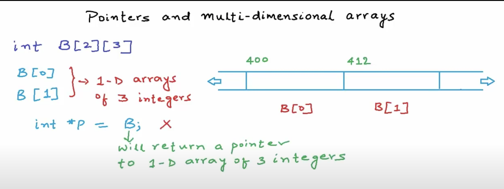

Multi-dimentional arrays
|   |  200 | 204  |  208 |   |   |   |   |  300 | 304  |    | int A[5]  |
| --- | --- | --- | --- | --- | --- | --- | --- | --- | --- |--- |--- |
|   |  2 | 5  |  1 |   |   |   |   |  8 |   |
|   |  A[0] |A[1]  |  A[2] |  ,,, |   |   |   |  A[n]|   |   |int *P = A;  |

```C
Print P   // 200
Print *P    // 2
Print *(P + 2)  //1

*(A+i) eq   A[i]

(A+i)  eq   &A[i]

P = A
A ≠ P // complilation error
```

```C
int B[2][3] two one dim arrays 
B[0]
B[]
```



 The name of the array is a pointer to the first element

 int *P = B; //error 

B is a pointer to a 1D array of three integers


Type matters when dereferencing
```C
int (*P)[3] = B

print B or &B[0] or &B[0][0]                           //400

print B+1                                              // 400 + 12 = 412

print *(B+1)  || B[1] || & B[1][0]                     //412
print *(B+1) + 2    || B[1]+3   ||  &B[1][2]           //420
print *(*B[0] + 1) = 3

```

for a 2-D Array

```C
B[i][j] = *(B[i]+j)
        = *(*(BB+i)+j)
```
